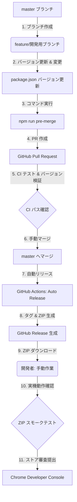

# リリース・ストア公開プロセスガイド

本リポジトリにおける Pull Request の作成から、GitHub Actions による自動ビルド、および Chrome Web Store（Chrome Developer Console）へのストア公開までの開発リリースフローを記します。

---

## 全体フロー図



---

## 1. 開発およびバージョン更新 (PR 作成まで)

個人開発のため、基本的には `master` ブランチから直接機能開発用のブランチ（例: `feature/xxx`）を切って作業を行います。

`master` ブランチにマージされるものは**すべてストア公開用パッケージ**として扱います。そのため、PR 作成前に以下の手順を必ず実行します。

### ステップ 1: バージョンの更新 (正本の変更)
1. `package.json` の `"version"` フィールドを新しいバージョン (例: `1.7.0`) に更新します。

### ステップ 2: ローカル一括同期・自動整形の実行
リポジトリ全体のバージョン同期やフォーマットの適用忘れを防ぐため、マージ前自動一括コマンドを実行します。
```bash
npm run pre-merge
```
このコマンドは内部で以下を全自動で実行します。
1. **バージョン同期** (`version:sync`): `package.json` を正本として、`manifest.json` と HTML 内のキャッシュバスター (`?v=...`) を自動更新・保存します。
2. **自動整形** (`format`): Prettier を用いてコードを整形します。
3. **静的解析自動修正** (`lint:fix`): ESLint の修正可能エラーを自動で修復します。
4. **テスト検証** (`test`): i18n 構成チェックと Jest テストが正常に通過するか確認します。
5. **リリースビルド生成** (`build`): ローカルで ZIP パッケージの正常生成を検証・作成します。

### ステップ 3: リリースノート (変更履歴) の作成
1. `CHANGELOG.md` を更新し、今回の変更内容を追記します。
2. 以下のコマンドを実行し、`CHANGELOG.md` の記述を `src/changelog.json` に反映させます。
   ```bash
   npm run changelog
   ```

### ステップ 4: PR の作成と CI パス
1. 変更をコミットし、プッシュして `master` に向けて Pull Request (PR) を作成します。
2. PR を作成すると、GitHub Actions にて以下の検証が自動実行されます。
   - **`Version Sync & Bump Check` (version-check.yml)**: リポジトリ内のバージョンに同期ズレがないか、およびベースブランチからバージョンが正しく上がっているかを検証します。
   - **`CI Tests` (test.yml)**: フォーマット、Linter、Jest 単体テスト、および **オフラインリンクチェッカー (Link Checker)** が通過するか検証します。
     - *補足*: リンクチェッカーは、`https://rikutoyamada01.github.io/atcoder-workspace/` から始まる本番公開用 URL をローカルの `./pages/` に自動リマップしてチェックします。これにより、マージ前かつインターネット未公開の状態であっても、PR 内の新規ファイルや相対パスへのリンク切れを 100% 事前に検知できます。

---

## 2. マージプロセス

1. GitHub Actions のすべての検証（CI）が正常にパスしていることを確認します。
2. 開発者 (人間) が GitHub 上で PR を **`master` へマージ** します。

---

## 3. ストア公開プロセス (マージ後の流れ)

`master` へマージされると、GitHub Actions が自動的にリリースビルドとパッケージ作成を実行します。

### ステップ 1: GitHub Release の自動生成
1. `master` へのマージ/プッシュに伴い、**`Auto Release Workspace Extension` (release.yml)** ワークフローが起動します。
2. 新しいバージョン番号に対応する Git タグ（例: `v1.7.0`）が自動で作成・プッシュされます。
3. `npm run build` が実行され、リリース用の ZIP パッケージ（例: `dist/atcoder-workspace-v1.7.0.zip`）がビルドされます。
4. 変更履歴と ZIP パッケージが添付された **GitHub Release が自動で作成・公開** されます。

### ステップ 2: Chrome Web Store への提出 (開発者による手動作業)
1. 作成された GitHub Release ページを開き、添付されている `atcoder-workspace-v[バージョン].zip` をローカルにダウンロードします。
2. [Chrome Developer Console (Chrome ウェブストア デベロッパー ダッシュボード)](https://chrome.google.com/webstore/devconsole) にログインします。
3. 対象の拡張機能を選択し、[パッケージ] セクションからダウンロードした ZIP パッケージをアップロードします。
4. ストアの情報を必要に応じて更新し、**[審査のため送信]** をクリックして提出します。

---

## 4. マージ前の事前確認チェックリスト (開発環境で検証しにくい項目)

`master` へのマージおよびストア公開前に、ローカル開発環境では見落としがちな以下の重要チェック項目を手動で確認してください。

### ☐ GitHub Pages のデプロイ・表示確認
* **公開URLの整合性**: ソースコードや README 内のドキュメントリンクから、不要な `/pages/` プレフィックスが排除されているか？
  - 正: `https://rikutoyamada01.github.io/atcoder-workspace/article/glossary.html`
  - 誤: `https://rikutoyamada01.github.io/atcoder-workspace/pages/article/glossary.html` (404 になります)
* **相対リンクとアセット**: `pages/` ディレクトリ配下の HTML を Pages に公開した際、画像や別ページへの相対リンクが正しく動くか？

### ☐ ストア用 ZIP 成果物の内容確認
ローカル開発時は `src/` などの生ディレクトリを参照していますが、ストアにはビルドされた ZIP を提出します。
* **ビルドのローカル実行**: ローカルで `npm run build` を実行します。
* **成果物の中身**: `dist/` 内に生成された ZIP を解凍し、必要なファイルが全て含まれているか確認します。
  - 新しく追加したライブラリやアセットディレクトリがある場合、[build-release.js](file:///c:/Users/yamadarikuto/Mycode/atcoder-workspace/scripts/build-release.js#L37-L45) の `filesToCopy` 配列にコピー対象として登録されているか？
  - 逆に、不要なファイル（`.git`、`node_modules`、テストコード `tests/`、ローカルスクリプト `scripts/`）が ZIP に混入していないか？

### ☐ 権限の精査 (審査の遅延・リジェクト防止)
* `manifest.json` の `permissions` や `host_permissions` に余分な項目が増えていないか？
  - ※ウェブストアの審査ガイドラインにおいて、必要最小限のパーミッション（Principle of Least Privilege）から外れた過剰な権限があると、審査期間が数日〜数週間に長引くか、リジェクトの原因になります。

### ☐ `changelog.json` の同期
* `npm run changelog` が実行され、拡張機能のオプション画面等で表示される変更履歴が最新の状態に更新されているか？

---

## 5. マージ後・ストア提出前の最終確認チェックリスト (出荷検品)

`master` にマージされ、各 GitHub Actions ワークフローが完了した後、Chrome Developer Console に ZIP をアップロードして最終提出する前に、必ず本番デプロイ環境での動作確認（出荷検品）を手動で行ってください。


### ☐ 自動生成されたリリース ZIP のスモークテスト
GitHub Actions によって `v[バージョン]` タグの Release が自動生成され、ZIP 成果物が添付されます。
* **Release からのダウンロード**: 生成された GitHub Release ページから、自動添付された `atcoder-workspace-v[バージョン].zip` をダウンロードし、一度解凍します。
* **マニフェストバージョンの二重確認**: 解凍したフォルダの `manifest.json` をエディタ等で開き、バージョンが新リリースバージョンになっていることを最終確認します。
* **実機インストールテスト**: Chrome の `chrome://extensions/` にて「パッケージ化されていない拡張機能を読み込む」を選択し、上記で解凍したフォルダを読み込ませます。
  - 拡張機能が正常に読み込めるか（エラーマークが出ないか）を確認します。
  - AtCoder の問題ページやコードテスト等の主要画面を開き、Monaco Editor の描画、学習ノートの表示など、コア機能が壊れていないか煙動作テスト（Smoke Test）を行ってください。


