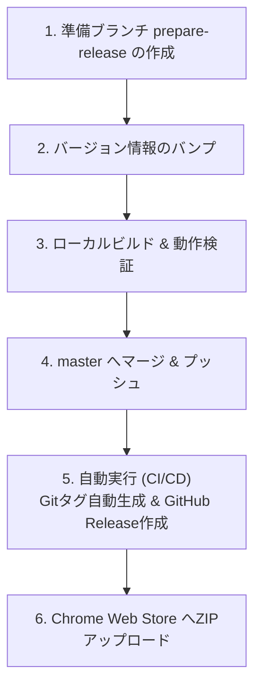

# AtCoder Workspace リリース手順書

本ドキュメントは、本拡張機能（AtCoder Workspace）の管理者（ユーザー様）専用のリリース作業手順書です。

本プロジェクトには**リリース自動化 CI/CD** が組み込まれているため、ユーザー様は `master` ブランチへバージョンを更新してプッシュ（マージ）するだけで、自動的に Git タグの作成と GitHub リリースが完了します。

---

## 概要図


---

## リリース手順

### Step 1. リリース準備ブランチの作成
新しいバージョンを準備するための作業用ブランチを作成します。
```bash
git checkout master
git pull origin master
git checkout -b prepare-release
```

### Step 2. バージョンのバンプ（更新）
リリースする新しいバージョン番号を、以下の2つのファイルに反映します。
1. **`package.json`** (`"version"` フィールド)
2. **`manifest.json`** (`"version"` フィールド)

> [!NOTE]
> 例として、`1.3.0` から `1.4.0` にアップデートする場合は、両方のファイルを `1.4.0` に書き換えて保存します。

### Step 3. ローカルビルドと動作検証
1. 依存関係と Monaco Editor の静的ファイルをセットアップします（初回のみ、または依存変更時）。
   ```bash
   npm install
   npm run setup
   ```
2. リリースパッケージ（ZIP）をビルドします。
   ```bash
   npm run build
   ```
   ビルドが成功すると、`dist/` ディレクトリ配下に `atcoder-workspace-vX.Y.Z.zip` が生成されます。
3. **動作確認**:
   - `dist/atcoder-workspace-vX.Y.Z.zip` を一度解凍します。
   - Google Chrome で `chrome://extensions/` を開きます。
   - 「デベロッパーモード」をONにし、「パッケージ化されていない拡張機能を読み込む」から解凍したフォルダを選択します。
   - 実際に AtCoder の問題ページを開き、エディタや自動テスト、提出ポップアップ、アイコン表示などが正常に動作することを確認します。

### Step 4. master へのマージとプッシュ
検証が問題なければ、リリース準備ブランチの変更をコミットし、`master` ブランチへマージしてプッシュします。
```bash
git add .
git commit -m "chore: Prepare release vX.Y.Z"
git checkout master
git merge prepare-release
git push origin master
```
マージが終わったら、使い終わった `prepare-release` ブランチは削除して構いません。

### Step 5. 自動リリース（CI/CDの動作）
`master` ブランチへ `manifest.json` の変更がプッシュされると、GitHub Actions が以下の処理を全自動で実行します。
- `manifest.json` 内のバージョン情報を読み取る。
- 該当バージョン（例: `v1.4.0`）の Git タグがまだリポジトリに存在しない場合、**自動的に Git タグを作成してプッシュ**する。
- 自動で ZIP をビルドし、タグ名に基づいた **GitHub Release を生成して ZIP を添付**する。

> [!TIP]
> ユーザー様が手動で `git tag` コマンドを実行してプッシュする必要はありません。

### Step 6. Chrome Web Store (CWS) への申請
1. [Chrome Web Store Developer Console](https://chrome.google.com/webstore/devconsole) にログインします。
2. 自動生成された GitHub Release ページ、あるいはローカルの `dist/` 配下にある最新の `atcoder-workspace-vX.Y.Z.zip` ファイルをデベロッパーコンソールにアップロードします。
3. ストアの掲載情報（説明文など）を更新する場合は、`docs/private/store-description.md` の記述をコピー＆ペーストして利用します。
4. 「審査に送信」をクリックします（審査には通常数日から1週間程度かかります）。
